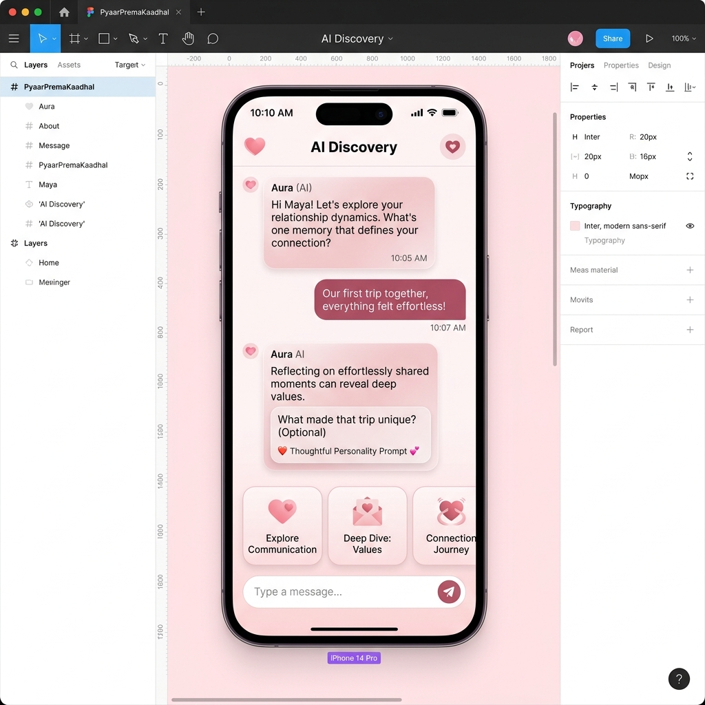
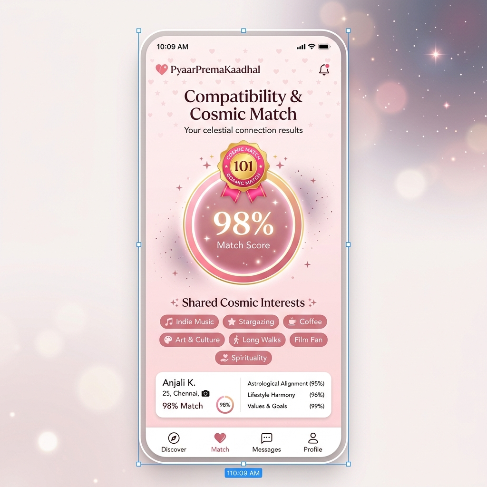
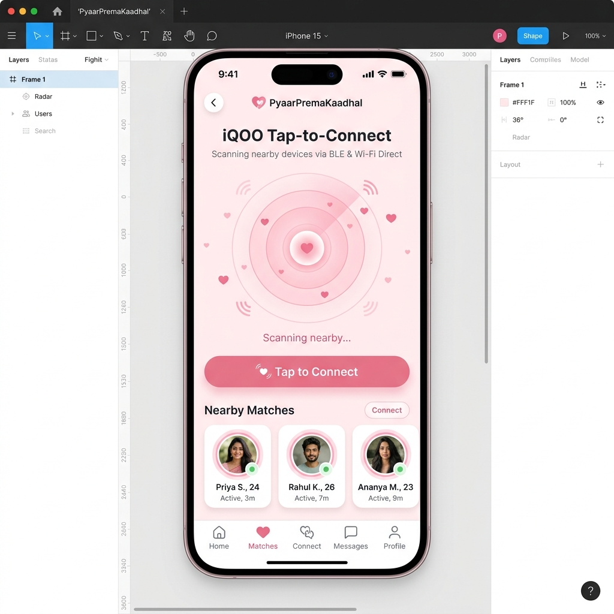

# 💖 PyaarPremaKaadhal — System Design Specification
### *Mobile-First, 100% On-Device AI Relationship Discovery Platform*
**Engineered for iQOO 15 (Qualcomm Snapdragon 8 Elite Gen 5 NPU)**

[-C9A27E?style=for-the-badge)](#)

---

## 🚀 What We Are Building (Hackathon Implementation Scope)

**PyaarPremaKaadhal** is an AI-powered, mobile-first relationship discovery and social connection platform designed for modern Android flagships (primary target: **iQOO 15** with Snapdragon 8 Elite Gen 5 NPU). 

### Key Systems Built for Demo:
1. **Phase 0 & 1 On-Device Discovery:** A 2-day conversational onboarding pipeline powered by **Gemma 3 (4B QAT int4)** executing locally on the Snapdragon NPU via LiteRT + Qualcomm AI Engine Direct (QNN).
2. **Phase 2 Vector Extraction:** Personality encoding using **EmbeddingGemma 300M**, MRL-compressed into a privacy-preserving **128-dimensional vector**.
3. **Phase 3 Compatibility Match Engine:** Local mathematical scoring using normalized cosine similarity:
   $$\text{score} = \text{round}\left(\frac{\text{cosine}_{\text{similarity}}(A, B) + 1}{2} \times 100\right)$$
   Includes the **"101 Cosmic Match"** rarity badge awarded when compatibility ranks in the top **0.5%** AND the pair shares **$\ge 2$ rare niche tags**.
4. **Phase 4 Anonymous Bonding Window:** 7-day anonymous communication channel backed by an **On-Device PII Guardrail** (Regex + Gemma Prompt Guard + `FLAG_SECURE`) to prevent contact detail leakage.
5. **iQOO-to-iQOO Tap-to-Connect:** Offline peer discovery via Android Nearby Connections API (BLE advertisement + Wi-Fi Direct channel) for instant in-person compatibility checks and offline chat.

---

## 📱 Mobile App Prototype

  
  
  

  <b>AI Discovery</b> &nbsp;&nbsp;&nbsp;
  <b>Compatibility & Cosmic Match</b> &nbsp;&nbsp;&nbsp;
  <b>iQOO Tap-to-Connect</b>

> A privacy-first relationship discovery experience powered by
> on-device AI, personality embeddings, compatibility intelligence,
> anonymous bonding, and iQOO Tap-to-Connect.

---

## 📑 Master System Design Specification Index

All primary system design documents are located under [`docs/system-design/`](file:///c:/Users/Administrator/Downloads/Team-CodeRed-System-Design-IQOO/docs/system-design/):

| Document File | Topic Title | Comprehensive Technical Content |
| :--- | :--- | :--- |
| 📑 [`00-overview.md`](file:///c:/Users/Administrator/Downloads/Team-CodeRed-System-Design-IQOO/docs/system-design/00-overview.md) | **Product Vision & Scope** | System vision, problem statement, hardware target specifications (iQOO 15 Snapdragon 8 Elite Gen 5 NPU), 5-phase user lifecycle, and explicit non-goals. |
| 🏛️ [`01-high-level-architecture.md`](file:///c:/Users/Administrator/Downloads/Team-CodeRed-System-Design-IQOO/docs/system-design/01-high-level-architecture.md) | **High-Level Design (HLD)** | Complete 5-layer system architecture (Presentation, Storage, On-Device AI Core, Connectivity Mesh, Cloud Relay) with component rationale (WHAT, WHY, WHAT BREAKS WITHOUT IT). |
| 🔄 [`02-low-level-design.md`](file:///c:/Users/Administrator/Downloads/Team-CodeRed-System-Design-IQOO/docs/system-design/02-low-level-design.md) | **Low-Level Design (LLD)** | Executable sequence diagrams for 5 critical user flows: Registration, Phase 1 AI Dialogue, Phase 2 Vector Extraction, Phase 3 Cosmic Matching, and Phase 4 PII Guardrails. |
| 🗄️ [`03-data-model.md`](file:///c:/Users/Administrator/Downloads/Team-CodeRed-System-Design-IQOO/docs/system-design/03-data-model.md) | **Data Model & Schemas** | Local Encrypted Room SQLite schemas (`User`, `Profile`, `PersonalityVector`, `Match`, `ChatMessage`, `GuardrailEvent`), TTL purge policies, and SQLCipher AES-256 KeyStore encryption. |
| 📡 [`04-api-spec.md`](file:///c:/Users/Administrator/Downloads/Team-CodeRed-System-Design-IQOO/docs/system-design/04-api-spec.md) | **API Specifications** | Formal specs for Firebase Auth exchange, vector submission REST endpoints, candidate fetching, WebSocket real-time streams, FCM push triggers, and Nearby Connections IPC payloads. |
| 🧠 [`05-on-device-ai.md`](file:///c:/Users/Administrator/Downloads/Team-CodeRed-System-Design-IQOO/docs/system-design/05-on-device-ai.md) | **On-Device AI Engine** | Gemma 3 (4B int4) + EmbeddingGemma 300M (128-dim MRL) execution specs, NPU memory budgeting (3,584 tokens), rolling context summarization, and 3-tier PII safety guardrails. |
| ⚖️ [`07-scaling-and-tradeoffs.md`](file:///c:/Users/Administrator/Downloads/Team-CodeRed-System-Design-IQOO/docs/system-design/07-scaling-and-tradeoffs.md) | **Scaling & Trade-Offs** | Global model CDN differential delta updates, regional LSH match relays, NPU thermal/power duty cycle budgeting (<1.2W draw), and architectural trade-offs. |
| 🛡️ [`08-risk-safety-ethics.md`](file:///c:/Users/Administrator/Downloads/Team-CodeRed-System-Design-IQOO/docs/system-design/08-risk-safety-ethics.md) | **Risk, Safety & Ethics** | 18+ identity age-gating, DPDP Act 2023 (India) statutory alignment, local abuse reporting, crisis hotline intervention (Tele-MANAS `14416` & iCall), and safety boundaries. |

---

## 🎨 Master Visual Diagrams Breakdown

All visual diagrams are authored in pure Mermaid syntax under [`docs/system-design/diagrams/`](file:///c:/Users/Administrator/Downloads/Team-CodeRed-System-Design-IQOO/docs/system-design/diagrams/):

| Diagram File | Diagram Type | System Component Illustrated |
| :--- | :--- | :--- |
| 📐 [`architecture-overview.mmd`](file:///c:/Users/Administrator/Downloads/Team-CodeRed-System-Design-IQOO/docs/system-design/diagrams/architecture-overview.mmd) | **C4 Container System Architecture** | Illustrates the boundary separation between the local iQOO Android device (Compose UI, SQLCipher DB, Snapdragon NPU AI Core, Nearby Mesh) and the minimal cloud relay (Firebase Auth, Match Relay, FCM Push). |
| 🔄 [`on-device-ai-flow.mmd`](file:///c:/Users/Administrator/Downloads/Team-CodeRed-System-Design-IQOO/docs/system-design/diagrams/on-device-ai-flow.mmd) | **On-Device AI Sequence Flow** | Illustrates step-by-step processing of user dialogue through Gemma 3 NPU inference (~28 tok/s), EmbeddingGemma 128-dim MRL vector extraction, local storage, and Tier 1 Regex PII guardrail blocking. |
| 📱 [`tap-to-connect-flow.mmd`](file:///c:/Users/Administrator/Downloads/Team-CodeRed-System-Design-IQOO/docs/system-design/diagrams/tap-to-connect-flow.mmd) | **Tap-to-Connect P2P Flow** | Maps the offline device-to-device interaction flow: BLE advertisement beacon scanning, Wi-Fi Direct P2P handshake with ECDH key exchange, offline 128-dim vector swap, and direct encrypted chat bootstrap. |
| 🎯 [`matching-flow.mmd`](file:///c:/Users/Administrator/Downloads/Team-CodeRed-System-Design-IQOO/docs/system-design/diagrams/matching-flow.mmd) | **Vector Scoring & Cosmic 101 Rarity Logic** | Flowchart detailing how candidate vectors undergo cosine similarity calculation, score normalization, top 0.5% threshold check, rare niche tag overlap ($\ge 2$), and "101 Cosmic Match" badge award logic. |

---

**PyaarPremaKaadhal Architecture** • Engineered for Privacy, Performance & Meaningful Connection  
*Team CodeRed — iQOO Hackathon 2026*

