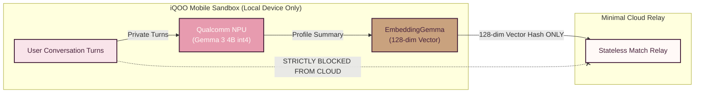
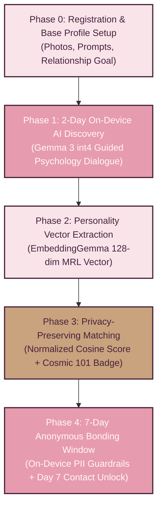

# 00 — Product Overview & System Vision

> [!NOTE]
> **TL;DR**  
> **Who cares:** Hackathon evaluators, product managers, privacy auditors, and non-engineering judges.  
> **What it does:** Outlines SoulSync’s product vision, core problem statement, phase-based user lifecycle, and architectural boundaries.  
> **Why this approach:** Solves online dating fatigue and privacy violations by executing 100% of LLM personality analysis locally on the smartphone NPU.  
> **What it costs:** Zero server-side AI compute cost; requires an Android device with Snapdragon NPU acceleration.

---

## Acronym Glossary

* **NPU (Neural Processing Unit):** Dedicated hardware silicon inside modern mobile processors optimized for matrix math and deep neural network acceleration.
* **LLM (Large Language Model):** Generative artificial intelligence models capable of understanding and synthesizing natural language dialogues.
* **PII (Personally Identifiable Information):** Any user data that can disclose identity, such as phone numbers, email addresses, handles, or live photos.
* **MRL (Matryoshka Representation Learning):** A machine learning technique that embeds high-dimensional vectors (e.g., 768 dimensions) into nested lower dimensions (e.g., 128 dimensions) without severe accuracy loss.
* **QNN (Qualcomm AI Engine Direct):** Qualcomm's software development kit enabling low-level execution of neural networks directly on Snapdragon NPUs.
* **FCM (Firebase Cloud Messaging):** Google's cross-platform messaging solution for delivering push notification alerts to mobile devices.
* **DPDP Act (Digital Personal Data Protection Act 2023):** India’s primary statutory data privacy regulation governing personal data processing.

---

## Problem Statement & Product Vision

Modern online dating applications suffer from three systemic flaws:

1. **Superficial Swipe Fatigue:** User evaluation relies almost entirely on visual presentation, leading to shallow interactions and rapid user churn.
2. **Privacy & Data Exploitation:** Centralized servers store sensitive intimate conversations, making user profiles vulnerable to data breaches, unauthorized data scraping, and third-party monetization.
3. **Behavioral Inauthenticity:** Gamified interfaces incentivize users to project idealized personas rather than revealing authentic psychological traits.

### The SoulSync Privacy Guarantee

---

## Target Audience & Hardware Specifications

SoulSync is engineered mobile-first for modern flagship Android hardware, with an eventual path to iOS via Swift.

### Primary Hardware Benchmark: iQOO 15
* **System on Chip (SoC):** Qualcomm Snapdragon 8 Elite Gen 5.
* **NPU Architecture:** Hexagon NPU featuring a ~37% performance boost in neural matrix math compared to prior generations `[assumption — verify against Qualcomm benchmark announcements]`.
* **System Memory:** Up to 16 GB LPDDR5X RAM (allocating ~2.5 GB dedicated VRAM/RAM for Gemma 3 int4 and ~300 MB for EmbeddingGemma).
* **Thermal Target:** Continuous NPU execution constrained under 1.2W power draw to maintain cool thermal performance during active dialogue sessions.

### Graceful Fallback Target: Snapdragon 8 Gen 2+ Devices
* Devices equipped with Snapdragon 8 Gen 2 or Gen 3 dynamically reduce Gemma 3 execution precision and throttle prompt processing speed (tokens/sec) to preserve thermal stability while retaining full functional compatibility.

---

## The 5-Phase User Lifecycle

### Phase Breakdown
* **Phase 0 — Registration:** User builds a profile with photos, preferences, age verification (18+), and relationship goal (**Soulmate** vs. **Casual**).
* **Phase 1 — 2-Day AI Chat:** User engages in guided natural language dialogue with on-device Gemma 3. Daily sessions roll into profile memory.
* **Phase 2 — Vector Extraction:** EmbeddingGemma 300M processes profile data into a privacy-preserving **128-dimensional MRL vector**.
* **Phase 3 — Compatibility Matching:** Vectors are exchanged via minimal cloud relay. Similarity score is calculated locally via $\text{score} = \text{round}\left(\frac{\text{cos\_sim} + 1}{2} \times 100\right)$. Rare pairs (top 0.5% + $\ge 2$ niche tags) receive the **"101 Cosmic Match"** badge.
* **Phase 4 — 7-Day Anonymous Window:** Matched users chat anonymously. On-device PII Guardrails block phone numbers, emails, handles, or photos. Day 7 unlocks full identity exchange.

---

## Scope & Non-Goals

### In-Scope for Architectural Design
1. Complete Android client system design using Kotlin, Jetpack Compose, and Room SQLite.
2. Full technical integration spec for Qualcomm AI Engine Direct (QNN) and LiteRT.
3. Complete security model for on-device PII guardrails and privacy-preserving vector exchange.

### Explicit Non-Goals
1. **Cloud LLM Hosting:** Server-side LLM inference is explicitly excluded from the architecture.
2. **Centralized Chat Backup:** Server-side retention of user chat messages is strictly prohibited.
3. **Web Client Platform:** Browser-based desktop clients are out of scope for the mobile-first strategy.
