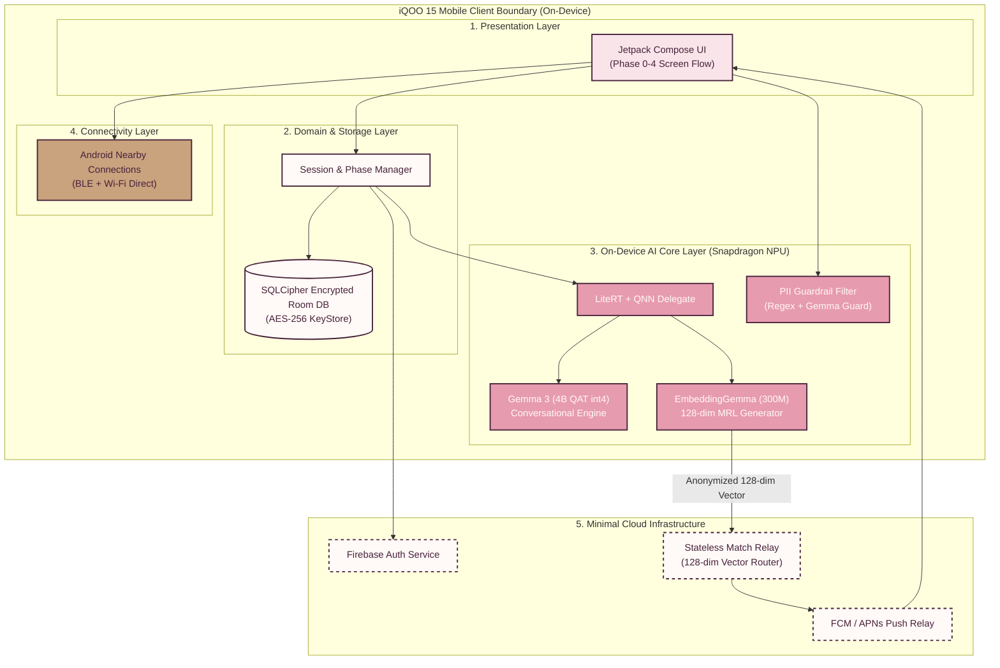

# 01 — High-Level Architecture (HLD)

> [!NOTE]
> **TL;DR**  
> **Who cares:** System architects, mobile leads, privacy auditors, and infrastructure engineers.  
> **What it does:** Defines SoulSync's multi-layered system architecture separating client UI, on-device AI runtime, offline mesh, and minimal cloud relay.  
> **Why this approach:** Enforces absolute privacy isolation by keeping chat history and raw embeddings bounded inside local app storage.  
> **What it costs:** Minimal server overhead (microsecond relay routing); NPU power draw managed via hardware duty cycles.

---

## Acronym Glossary

* **HLD (High-Level Design):** Architectural blueprint outlining system components, boundaries, and communication paths.
* **UI (User Interface):** The visual layout and interactive components presented to the mobile application user.
* **IPC (Inter-Process Communication):** Mechanisms allowing distinct processes or system components to exchange data locally.
* **BLE (Bluetooth Low Energy):** A power-efficient wireless radio technology used for short-range device discovery.
* **REST (Representational State Transfer):** Architectural style for network software interfaces using HTTP protocol.
* **WebSocket:** Computer communications protocol providing full-duplex communication channels over a single TCP connection.

---

## High-Level System Architecture Diagram

---

## Plain-English Explanation of Architecture Diagram

> [!TIP]
> **Read this in 60 seconds:**  
> The diagram illustrates the complete separation between what happens **on your phone** versus **in the cloud**. Everything related to your personal thoughts, chats, and AI personality analysis stays strictly inside the top box (your phone). The bottom box (the cloud server) acts like a blind mailman: it only carries anonymized math numbers (128-dimensional vectors) and notification alerts between matched phones. It never sees your name, photos, or chat messages.

---

## Layer Responsibilities & Component Breakdown

### 1. Presentation Layer (Android Kotlin + Jetpack Compose)
The top UI layer handles all user interactions, visual rendering, and local state management.
* **What it is:** A modern declarative user interface written in Kotlin using Jetpack Compose and Material 3 components.
* **Why it exists:** Provides fluid, reactive screen transitions across the 5 lifecycle phases while enforcing strict security rules like screenshot blocking (`FLAG_SECURE`).
* **What would break without it:** Users would have no visual interface to converse with the AI, review profile matches, or manage anonymous chat sessions.

### 2. Domain & Local Data Layer (Room SQLite + Android Architecture)
Manages local persistent storage, application state, and security key store integration.
* **What it is:** Android ViewModel architecture paired with an encrypted Room SQLite database and Android Keystore.
* **Why it exists:** Safely stores private chat logs, profile summaries, and local vector embeddings directly on the device using AES-256 encryption.
* **What would break without it:** Chat history and personality context would be lost whenever the app closes, or exposed to unauthorized malware.

### 3. On-Device AI Core Layer (LiteRT + Qualcomm QNN + Gemma 3)
The intelligence engine executing generative conversation, vector embedding extraction, and PII filtering.
* **What it is:** A runtime execution environment combining **LiteRT** (formerly TensorFlow Lite), **Qualcomm AI Engine Direct (QNN)** delegates, **Gemma 3 (4B QAT int4)**, and **EmbeddingGemma 300M**.
* **Why it exists:** Executes 100% of LLM inference directly on the Snapdragon NPU, achieving low latency and absolute data privacy.
* **What would break without it:** The core value proposition—private AI conversation and automated personality matching—would fail, forcing reliance on privacy-violating cloud APIs.

### 4. Connectivity Layer (Android Nearby Connections API)
Handles device-to-device offline discovery and high-speed local data transfer.
* **What it is:** An offline mesh communications engine utilizing Bluetooth Low Energy (BLE) for peer discovery and Wi-Fi Direct for high-bandwidth P2P connections.
* **Why it exists:** Powers the **Tap-to-Connect** feature, allowing nearby iQOO users to compare compatibility scores and chat offline without cellular internet.
* **What would break without it:** In-person instant connection features would be impossible during offline events, concerts, or weak signal areas.

### 5. Minimal Cloud Infrastructure Layer (Firebase Auth + FCM + Match Relay)
A lightweight server infrastructure managing identity tokens and anonymized vector exchanges.
* **What it is:** A stateless cloud backend combining Firebase Authentication, Firebase Cloud Messaging (FCM), and a microservice Match Relay written in Go/Node.js.
* **Why it exists:** Validates user account legitimacy and routes anonymized 128-dimensional vectors between distant devices.
* **What would break without it:** Remote users located in different cities would be unable to find matching partners or exchange notification signals.
