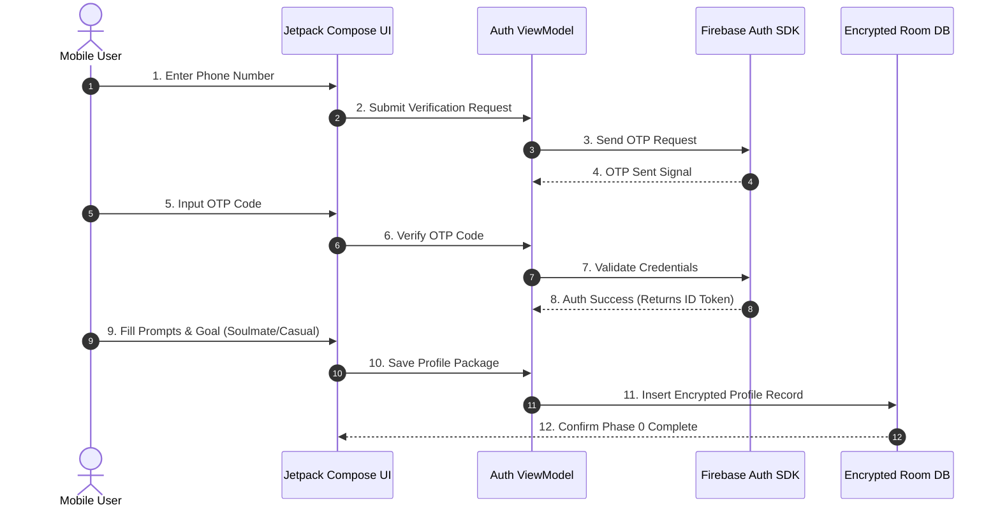
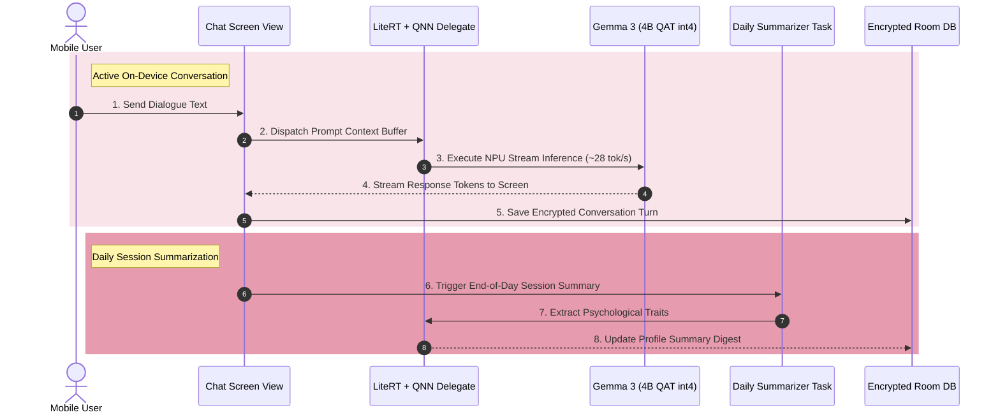
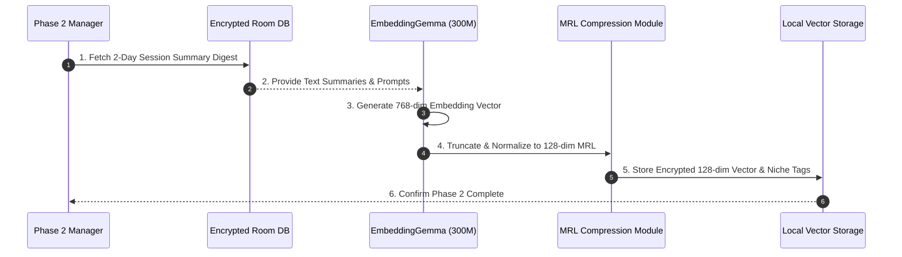
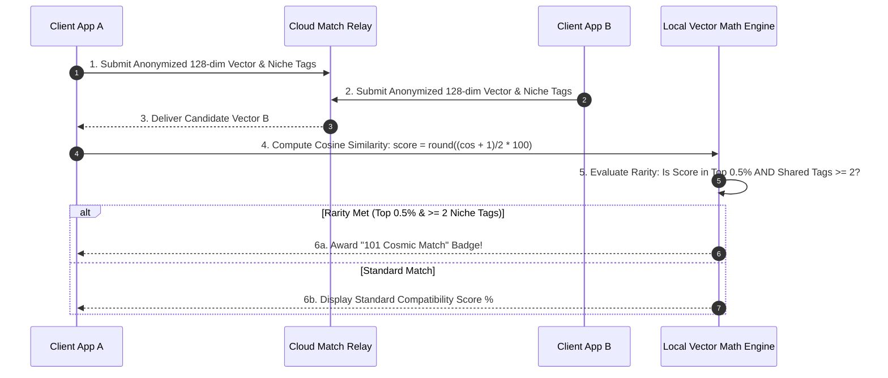
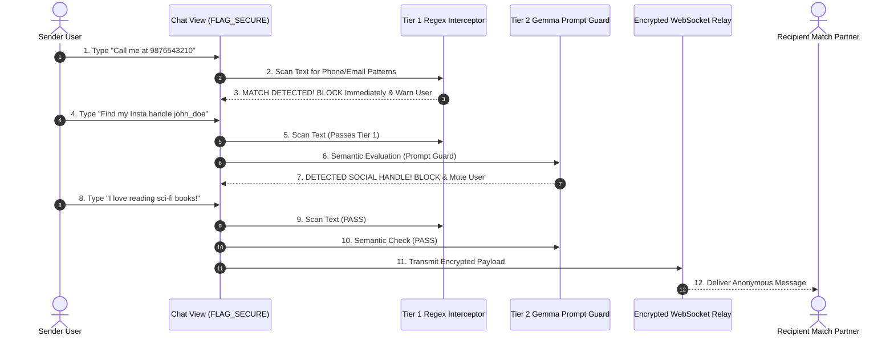

# 02 — Low-Level Design (LLD)

> [!NOTE]
> **TL;DR**  
> **Who cares:** Mobile software developers, QA automation leads, and technical reviewers.  
> **What it does:** Details low-level execution logic and sequence flows across SoulSync's 5 critical operational phases and PII guardrails.  
> **Why this approach:** Guarantees deterministic execution across on-device NPU pipelines, local storage transactions, and network relays.  
> **What it costs:** 100-300ms local NPU execution latency during vector generation; zero network overhead for LLM chat.

---

## Acronym Glossary

* **LLD (Low-Level Design):** Detailed component diagrams and workflow specifications describing exact method execution order.
* **UUID (Universally Unique Identifier):** A 128-bit label used to uniquely identify records across computer systems.
* **MRL (Matryoshka Representation Learning):** Nested vector embedding compression technique preserving semantic similarity at lower dimensions.
* **Regex (Regular Expression):** A sequence of characters specifying a search pattern for text matching and validation.
* **NPU (Neural Processing Unit):** On-device silicon processor optimized for neural network inference.

---

## Critical Flow 1: Registration & Profile Setup (Phase 0)

### Plain-English Explanation
> **Read in 60 seconds:** When you sign up, you verify your phone number using Firebase. You then answer setup prompts and pick your relationship goal (soulmate or casual). Everything you type is stored inside an encrypted vault on your phone. Nothing is sent to a cloud chat server.

---

## Critical Flow 2: On-Device 2-Day AI Chat & Rolling Summarization (Phase 1)

### Plain-English Explanation
> **Read in 60 seconds:** For two days, you chat naturally with Gemma 3, an AI living inside your phone's processor. The AI asks questions about your values and daily life. At night, the AI summarizes the key personality points into a compact daily log and saves it securely in your local vault.

---

## Critical Flow 3: Personality Vector Extraction & MRL Compression (Phase 2)

### Plain-English Explanation
> **Read in 60 seconds:** Once the 2-day chat finishes, SoulSync takes your profile answers and daily summaries and feeds them into EmbeddingGemma (an on-device AI model). It creates a 768-number map of your personality, then instantly shrinks it to a compact 128-number code using Matryoshka compression. This 128-number code hides raw details while preserving your core personality traits.

---

## Critical Flow 4: Compatibility Matching & "101 Cosmic Match" Rarity Evaluation (Phase 3)

### Plain-English Explanation
> **Read in 60 seconds:** Your phone sends its anonymized 128-number code to a tiny relay server, which swaps it with potential matching partners. Your phone receives candidate codes and calculates compatibility using vector math locally. If two people score in the top 0.5% AND share at least 2 rare niche hobbies, both phones award a special "101 Cosmic Match" badge!

---

## Critical Flow 5: Phase 4 Anonymous 7-Day Bonding Window & On-Device PII Guardrail Enforcement

### Plain-English Explanation
> **Read in 60 seconds:** During the 7-day anonymous window, you chat with your match using anonymized IDs. Before any message leaves your phone, an on-device safety guard scans it. If you try to send phone numbers, emails, or social media handles, the message is instantly blocked locally, and a warning is shown. Screenshotting is physically blocked by Android system flags (`FLAG_SECURE`).

---

## Component Rationale (WHAT, WHY, WHAT BREAKS WITHOUT IT)

### 1. Daily Summarizer
* **What it is:** An NPU background routine that condenses long chat history into bulleted psychological summaries.
* **Why it exists:** Keeps the LLM prompt context within memory budget limits without losing long-term user context.
* **What would break without it:** Gemma 3 would run out of memory or forget conversation details from Day 1.

### 2. MRL Compressor
* **What it is:** A vector transformation algorithm reducing 768-dim embeddings down to 128-dim vectors.
* **Why it exists:** Minimizes network payload bandwidth and hides raw feature dimensions for maximum privacy.
* **What would break without it:** Vector exchange would take 6x more bandwidth and expose excessive user metadata.

### 3. Regex & Gemma Guard Combination
* **What it is:** A 2-tiered filtering system combining instant pattern matching with local LLM semantic analysis.
* **Why it exists:** Regex catches obvious numbers instantly, while Gemma Guard catches sneaky workarounds (e.g., "nine eight seven six").
* **What would break without it:** Users could easily bypass safety rules during the anonymous 7-day bonding window.
