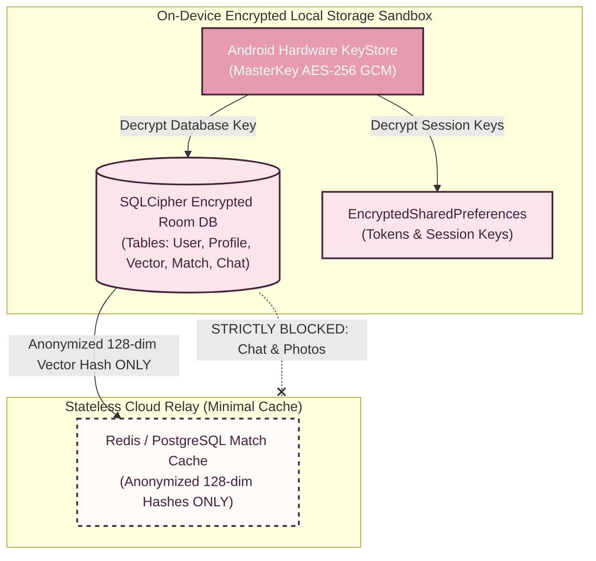
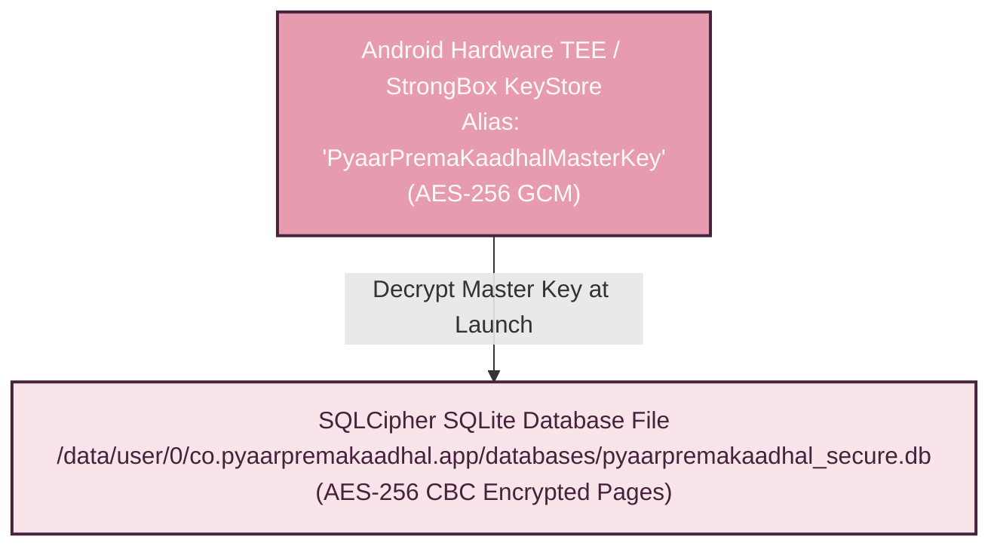

# 03 — Data Model & Storage Schemas

> [!NOTE]
> **TL;DR**  
> **Who cares:** Database engineers, mobile developers, privacy auditors, and security leads.  
> **What it does:** Outlines local Room SQLite schemas, EncryptedSharedPreferences, and minimal cloud relay payloads.  
> **Why this approach:** Ensures sensitive user chat logs and raw embeddings never leave local SQLite DB, while cloud schema only stores anonymized IDs.  
> **What it costs:** ~50 MB local SQLite storage footprint per user; negligible cloud DB payload (< 1 KB per match record).

---

## Acronym Glossary

* **SQL (Structured Query Language):** Standardized programming language used to manage relational databases.
* **PK (Primary Key):** Unique identifier attribute for a database table record.
* **FK (Foreign Key):** Database field that links records between two tables.
* **TTL (Time-to-Live):** Expiration period after which data records are automatically deleted or purged.
* **AES (Advanced Encryption Standard):** Symmetric encryption algorithm used to secure electronic data (AES-256).

---

## Storage Architecture Overview

---

## Local Database Entities (Room SQLite)

### 1. `User` Entity
Stores account metadata and local authentication state.

| Field Name | Data Type | Constraint | Description |
| :--- | :--- | :--- | :--- |
| `user_id` | `TEXT` | `PRIMARY KEY` | Anonymized UUID generated locally. |
| `firebase_uid` | `TEXT` | `NOT NULL, UNIQUE` | External Firebase authentication token identifier. |
| `phone_number` | `TEXT` | `NOT NULL` | User phone number (Encrypted). |
| `age` | `INTEGER` | `NOT NULL` | Verified user age (Must be $$\ge 18$$). |
| `created_at` | `INTEGER` | `NOT NULL` | Epoch timestamp of registration. |

### 2. `Profile` Entity
Stores onboarding preferences, prompts, and relationship goals.

| Field Name | Data Type | Constraint | Description |
| :--- | :--- | :--- | :--- |
| `profile_id` | `TEXT` | `PRIMARY KEY` | Profile record UUID. |
| `user_id` | `TEXT` | `FOREIGN KEY` | Link to `User.user_id` (`ON DELETE CASCADE`). |
| `relationship_goal` | `TEXT` | `NOT NULL` | Enum value: `SOULMATE` or `CASUAL`. |
| `bio_prompts_json` | `TEXT` | `NOT NULL` | JSON string containing prompt questions & user answers. |
| `photo_uris_json` | `TEXT` | `NOT NULL` | Encrypted local file URIs for profile photos. |
| `phase_status` | `INTEGER` | `NOT NULL` | Current phase indicator (`0`, `1`, `2`, `3`, or `4`). |

### 3. `PersonalityVector` Entity
Stores extracted personality embeddings and niche interest tags.

| Field Name | Data Type | Constraint | Description |
| :--- | :--- | :--- | :--- |
| `vector_id` | `TEXT` | `PRIMARY KEY` | Vector record UUID. |
| `user_id` | `TEXT` | `FOREIGN KEY` | Link to `User.user_id`. |
| `mrl_128_array` | `BLOB` | `NOT NULL` | Binary float array containing the 128-dim MRL vector. |
| `niche_tags_json` | `TEXT` | `NOT NULL` | Extracted niche interest tags (e.g., `["sci-fi", "bouldering"]`). |
| `summary_digest` | `TEXT` | `NOT NULL` | 2-day AI conversation summary digest. |
| `generated_at` | `INTEGER` | `NOT NULL` | Generation timestamp. |

### 4. `Match` Entity
Stores calculated compatibility scores and phase 4 status.

| Field Name | Data Type | Constraint | Description |
| :--- | :--- | :--- | :--- |
| `match_id` | `TEXT` | `PRIMARY KEY` | Unique match session identifier. |
| `partner_anon_id` | `TEXT` | `NOT NULL` | Anonymized ID of the matched candidate partner. |
| `compatibility_score` | `INTEGER` | `NOT NULL` | Normalized match percentage (`0` to `100`). |
| `is_cosmic_101` | `INTEGER` | `NOT NULL` | Boolean flag (`1` if top 0.5% & $$\ge 2$$ rare tags, else `0`). |
| `phase_4_start_time`| `INTEGER` | `NOT NULL` | Start timestamp of 7-day anonymous window. |
| `is_unlocked` | `INTEGER` | `NOT NULL` | Boolean flag (`1` if day 7 PII unlock approved by both). |

### 5. `ChatMessage` Entity
Stores all local messages (Phase 1 AI conversation & Phase 4 peer chat).

| Field Name | Data Type | Constraint | Description |
| :--- | :--- | :--- | :--- |
| `message_id` | `TEXT` | `PRIMARY KEY` | Message UUID. |
| `session_id` | `TEXT` | `NOT NULL, INDEX` | Foreign key referencing AI session or `Match.match_id`. |
| `sender_type` | `TEXT` | `NOT NULL` | Sender enum: `USER`, `AI_GEMMA`, or `MATCH_PARTNER`. |
| `content_text` | `TEXT` | `NOT NULL` | Encrypted message content text. |
| `flag_pii_violation`| `INTEGER` | `DEFAULT 0` | Indicator set if message violated PII guardrails. |
| `timestamp` | `INTEGER` | `NOT NULL` | Timestamp of message creation. |

### 6. `GuardrailEvent` Entity
Local security audit log tracking blocked PII attempts.

| Field Name | Data Type | Constraint | Description |
| :--- | :--- | :--- | :--- |
| `event_id` | `TEXT` | `PRIMARY KEY` | Guardrail event UUID. |
| `match_id` | `TEXT` | `NOT NULL` | Associated match session ID. |
| `detected_pii_type` | `TEXT` | `NOT NULL` | Type detected: `PHONE`, `EMAIL`, `SOCIAL_HANDLE`, `PHOTO`. |
| `trigger_rule` | `TEXT` | `NOT NULL` | Trigger mechanism: `REGEX_TIER1` or `GEMMA_GUARD_TIER2`. |
| `blocked_timestamp` | `INTEGER` | `NOT NULL` | Timestamp of block action. |

---

## Indexing & Time-to-Live (TTL) Policies

### Local Database Indexing
1. `CREATE INDEX idx_chat_session ON ChatMessage(session_id, timestamp);`  
   *Accelerates local chat thread rendering in Compose.*
2. `CREATE INDEX idx_match_score ON Match(compatibility_score DESC);`  
   *Speeds up Phase 3 match recommendation sorting.*

### Time-to-Live (TTL) & Purge Rules
* **Unmatched Candidates (Phase 3):** Candidate vectors from unmatched profiles automatically expire and purge after **14 days**.
* **Phase 1 Raw Chat Transcripts:** Raw text turns from the 2-day AI conversation are automatically purged **30 days** after vector extraction, leaving only the condensed profile summary digest.
* **Guardrail Audit Logs:** Local `GuardrailEvent` logs auto-delete after **90 days**.

---

## Data Encryption Strategy (SQLCipher & Android Keystore)

1. **Database Encryption:** SQLite database is fully encrypted using **SQLCipher** with AES-256 in CBC mode.
2. **Key Protection:** Key generation is managed by `MasterKeys.getOrCreate(MasterKeys.AES256_GCM_SPEC)` inside the Android TEE (Trusted Execution Environment) or StrongBox key store.
3. **App Storage Security:** Shared preferences use `EncryptedSharedPreferences` to prevent root-access extraction of tokens or session keys.
