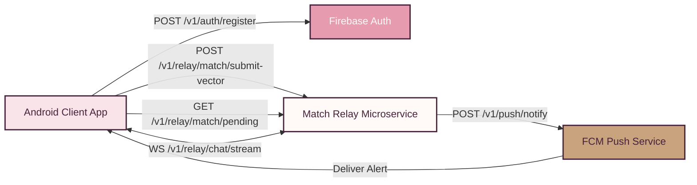

# 04 — API Specifications

> [!NOTE]
> **TL;DR**  
> **Who cares:** Backend developers, integration leads, QA engineers, and mobile developers.  
> **What it does:** Specifies REST, WebSocket, FCM push, and local Android IPC payload formats for PyaarPremaKaadhal.  
> **Why this approach:** Restricts cloud API surface area exclusively to match exchange and signal routing, preventing chat payload exposure.  
> **What it costs:** Minimal cloud bandwidth (~5 KB/day per active user); microsecond server routing latency.

---

## Acronym Glossary

* **API (Application Programming Interface):** A set of rules allowing distinct software applications to communicate.
* **REST (Representational State Transfer):** Standardized architecture for HTTP web services.
* **JSON (JavaScript Object Notation):** Lightweight data-interchange format.
* **HTTP (Hypertext Transfer Protocol):** Underlying application protocol of the World Wide Web.
* **WSS (WebSocket Secure):** Encrypted full-duplex communication protocol over TLS.
* **IPC (Inter-Process Communication):** Mechanisms for exchanging data between local app processes or devices.

---

## Global API Communication Architecture



---

## Global Authentication & Header Standard

All HTTPS requests to the PyaarPremaKaadhal Relay server must include the following headers:

```http
Authorization: Bearer <Firebase_ID_Token>
Content-Type: application/json
X-PyaarPremaKaadhal-Client-Version: 1.0.0-android
X-PyaarPremaKaadhal-Platform: Android-iQOO
```

---

## Endpoint 1: Firebase Auth Exchange

### `POST /v1/auth/register`
Exchanges a verified Firebase authentication token to establish an anonymized user profile session on the relay server.

* **Request Body:**
```json
{
  "firebase_token": "eyJhbGciOiJSUzI1NiIsImtpZCI6...",
  "age_verification_confirmed": true,
  "app_signature_hash": "a1b2c3d4e5f6..."
}
```

* **Success Response (`201 Created`):**
```json
{
  "status": "success",
  "data": {
    "anon_user_id": "usr_anon_98f4a1c0d2e3",
    "session_expires_at": 1787590000,
    "relay_cluster_endpoint": "wss://relay.pyaarpremakaadhal.co/v1/relay/chat/stream"
  }
}
```

* **Error Response (`400 Bad Request` / `403 Forbidden`):**
```json
{
  "status": "error",
  "code": "AUTH_AGE_GATING_FAILED",
  "message": "User must be 18 years of age or older to register."
}
```

---

## Endpoint 2: Submit Personality Vector

### `POST /v1/relay/match/submit-vector`
Uploads the 128-dimensional MRL vector and niche tags for match calculation.

* **Request Body:**
```json
{
  "anon_user_id": "usr_anon_98f4a1c0d2e3",
  "relationship_goal": "SOULMATE",
  "vector_version": "embedding_gemma_128_v1",
  "mrl_128_vector": [
    0.0412, -0.1189, 0.0891, 0.0023, -0.0512, 0.1298, 0.0711, -0.0345,
    0.0129, 0.0981, -0.0411, 0.0654, -0.0211, 0.0843, 0.0312, -0.0119
    /* ... 128 float values total ... */
  ],
  "niche_tags": ["sci-fi", "bouldering", "indie-folk"]
}
```

* **Success Response (`200 OK`):**
```json
{
  "status": "success",
  "data": {
    "vector_id": "vec_77a012b",
    "active_candidates_count": 1420
  }
}
```

---

## Endpoint 3: Fetch Pending Candidates

### `GET /v1/relay/match/pending`
Retrieves potential candidate vectors matching the user's relationship goal preference.

* **Query Parameters:**
  * `limit` (integer, default: `50`): Maximum candidate records to fetch.
  * `goal` (string, required): `SOULMATE` or `CASUAL`.

* **Success Response (`200 OK`):**
```json
{
  "status": "success",
  "data": {
    "candidates": [
      {
        "candidate_anon_id": "usr_anon_33e11f0a",
        "mrl_128_vector": [0.0398, -0.1102, 0.0811, 0.0019, -0.0489, 0.1201 /* ... 128 floats ... */],
        "niche_tags": ["sci-fi", "bouldering", "espresso"]
      }
    ]
  }
}
```

---

## Endpoint 4: Real-time Relay WebSocket Stream

### `WS /v1/relay/chat/stream`
Full-duplex encrypted WebSocket connection for routing Phase 4 anonymous chat messages.

* **Client Connection Handshake:**
  `wss://relay.pyaarpremakaadhal.co/v1/relay/chat/stream?token=<Firebase_ID_Token>&anon_id=usr_anon_98f4a1c0d2e3`

* **Outbound Message Payload (Client -> Server):**
```json
{
  "action": "send_message",
  "payload": {
    "match_id": "match_9901a1f",
    "recipient_anon_id": "usr_anon_33e11f0a",
    "encrypted_content_base64": "QWxsb3cgY2hhdCB0ZXh0IGVuY3J5cHRlZCB2aWEgU2lnbmFsIFByb3RvY29s...",
    "timestamp": 1787591200
  }
}
```

* **Inbound Delivery Payload (Server -> Recipient Client):**
```json
{
  "event": "new_message",
  "payload": {
    "match_id": "match_9901a1f",
    "sender_anon_id": "usr_anon_98f4a1c0d2e3",
    "encrypted_content_base64": "QWxsb3cgY2hhdCB0ZXh0IGVuY3J5cHRlZCB2aWEgU2lnbmFsIFByb3RvY29s...",
    "timestamp": 1787591200
  }
}
```

---

## Endpoint 5: Push Notification Signal Trigger

### `POST /v1/push/notify`
Triggers an out-of-band FCM/APNs push notification when a new match is generated or message received.

* **Request Body:**
```json
{
  "recipient_anon_id": "usr_anon_33e11f0a",
  "notification_type": "COSMIC_MATCH_FOUND",
  "payload_data": {
    "match_id": "match_9901a1f",
    "is_cosmic_101": true
  }
}
```

* **Success Response (`200 OK`):**
```json
{
  "status": "success",
  "delivered": true
}
```

---

## Local Android IPC Spec: Tap-to-Connect Payload

Used during offline BLE / Wi-Fi Direct exchange via Android Nearby Connections API.

* **Service ID:** `co.pyaarpremakaadhal.nearby.TAP_TO_CONNECT`
* **Payload Type:** `BYTES`

```json
{
  "protocol_version": 1,
  "device_model": "iQOO 15",
  "anon_user_id": "usr_anon_98f4a1c0d2e3",
  "relationship_goal": "SOULMATE",
  "mrl_128_vector": [0.0412, -0.1189, 0.0891, 0.0023 /* ... 128 floats ... */],
  "niche_tags": ["sci-fi", "bouldering"],
  "public_dh_key_base64": "MCowBQYDK2VwAyEAZ... (Ephemeral ECDH key for local chat encryption)"
}
```
