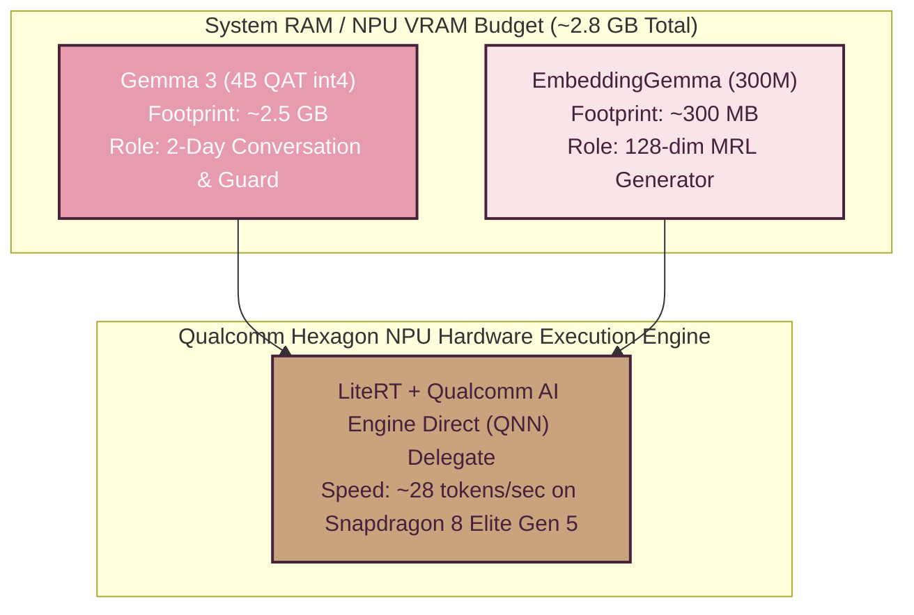
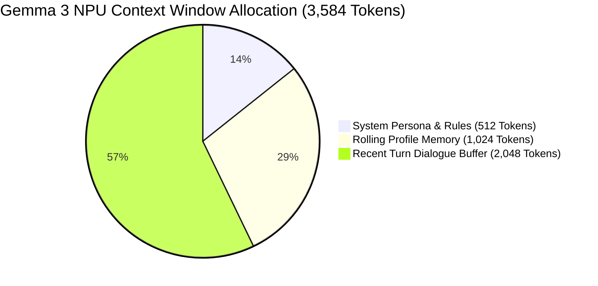
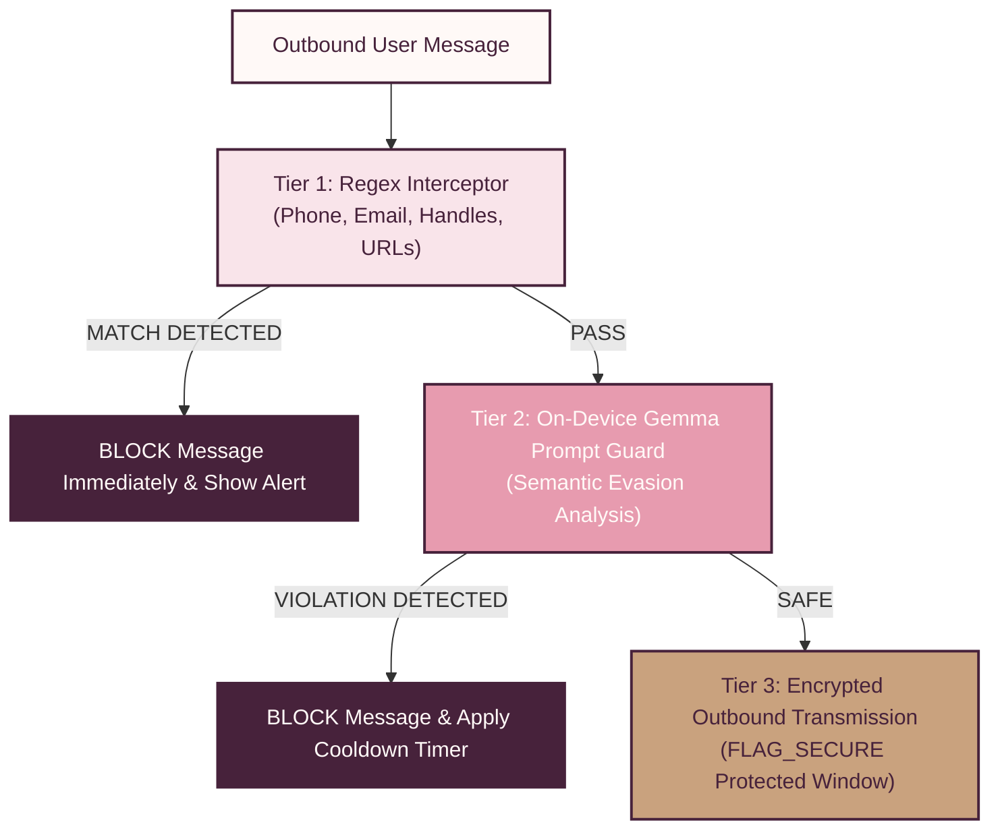

# 05 — On-Device AI Engine & Security Guardrails

> [!NOTE]
> **TL;DR**  
> **Who cares:** AI/ML engineers, NPU optimization leads, mobile security architects, and evaluators.  
> **What it does:** Documents on-device AI model orchestration, NPU memory budgeting, prompt engineering, injection defenses, and PII safety guardrails.  
> **Why this approach:** Running Gemma 3 (4B QAT int4) and EmbeddingGemma (300M) locally guarantees absolute privacy and offline operation.  
> **What it costs:** ~2.8 GB total system RAM/VRAM footprint (~2.5 GB Gemma 3 + ~300 MB EmbeddingGemma); ~1.2W NPU power draw during active inference.

---

## Acronym Glossary

* **NPU (Neural Processing Unit):** On-device silicon processor designed for matrix math acceleration.
* **QAT (Quantization-Aware Training):** Optimization method where model weights are trained directly for low-bit (int4) precision.
* **MRL (Matryoshka Representation Learning):** Technique enabling nested lower-dimensional embedding extraction from higher-dimensional representations.
* **QNN (Qualcomm AI Engine Direct):** Qualcomm SDK providing hardware-level access to Snapdragon NPUs.
* **PII (Personally Identifiable Information):** Data that can identify an individual (phone numbers, handles, emails).

---

## Model Footprint & NPU Hardware Ergonomics

### 1. Conversational Engine: Gemma 3 (4B QAT int4)
* **Model Size:** ~2.5 GB (4-bit int4 Quantization-Aware Training).
* **Execution Provider:** Qualcomm AI Engine Direct (QNN) delegate running on LiteRT + Qualcomm GENIE runtime engine.
* **Inference Speed:** ~28 tokens/second on iQOO 15 (Snapdragon 8 Elite Gen 5 NPU).
* **Role:** Powers Phase 1 discovery conversation, synthesizes daily profile summaries, and evaluates Tier 2 semantic prompt guards.

### 2. Embedding Engine: EmbeddingGemma 300M
* **Model Size:** ~300 MB.
* **Execution Provider:** LiteRT CPU/NPU delegate.
* **Dimensionality:** Generates 768-dimensional float embeddings, MRL-reduced to a **128-dimensional vector** (`float32[128]`).
* **Role:** Encodes profile responses and 2-day chat summaries into personality vectors.

---

## Prompt Context Budget & Rolling Summarization Strategy

The context window for Gemma 3 is strictly budgeted at **3,584 tokens** to optimize NPU RAM consumption:

### Context Allocation Breakdown
1. **System Persona & Guard Rules (512 Tokens):** Fixed prompt instructing Gemma 3 to act as an empathetic relationship discovery guide while enforcing safety rules.
2. **Rolling Profile Memory (1,024 Tokens):** Condensed summary digest of previous conversation turns and user preferences.
3. **Recent Turn Dialogue Buffer (2,048 Tokens):** Active sliding window storing the most recent 10 conversation turns.

### Rolling Summarization Algorithm
To prevent context overflow at the end of Day 1 and Day 2:
1. When the recent turn buffer reaches **1,800 tokens**, the system pauses context expansion.
2. An async background task invokes Gemma 3 with a specialized summarization prompt:  
   `"Summarize the user's psychological traits, values, hobbies, and emotional tone from these turns into 5 concise bullet points."`
3. The resulting summary replaces the oldest dialogue turns in the **Rolling Profile Memory** segment, maintaining a constant memory footprint.

---

## Prompt-Injection & Adversarial Defenses

1. **Delimiter Isolation:** User input is strictly wrapped inside custom structural XML tags (`<user_input>...</user_input>`).
2. **System Rule Precedence:** System instructions are injected after user inputs to ensure system guardrails override user manipulation attempts.
3. **Pattern Sanitization:** Input text containing system override triggers (e.g., `"Ignore previous instructions"`, `"System mode: ON"`) is stripped prior to LLM processing.

---

## PII Guardrail Architecture (Phase 4 Anonymous Window)

During the Phase 4 7-day anonymous bonding window, PyaarPremaKaadhal enforces a **3-Tiered PII Interceptor System**:

### Tier 1: Pattern Regex Interceptor (Instant)
Scans text instantly using optimized regular expressions:
* **Phone Numbers:** Catching digits, international formats, and spaced numbers (e.g., `\b\d{3}[-.\s]?\d{3}[-.\s]?\d{4}\b`).
* **Email Addresses:** Standard RFC 5322 matching (e.g., `[a-zA-Z0-9._%+-]+@[a-zA-Z0-9.-]+\.[a-zA-Z]{2,}`).
* **Social Media Handles:** Matching `@username`, `insta:`, `snap:`, `telegram:`.
* **URLs & Links:** Matching `http://`, `https://`, `wa.me/`.

### Tier 2: On-Device Gemma Prompt Guard (Semantic Analysis)
If text passes Tier 1 regex, Gemma 3 evaluates subtle or obfuscated evasion attempts (e.g., *"call me at nine eight seven..."* or *"my handle is john dot doe on the gram"*).
* **Prompt:** `"Analyze if this message discloses personal contact details or social handles: '<msg>'. Answer ONLY 'SAFE' or 'PII_VIOLATION'."`
* **Execution Time:** ~45ms on Snapdragon NPU.

### Tier 3: Display & System Level Protections
* **Screenshot Blocking:** Android window flag `WindowManager.LayoutParams.FLAG_SECURE` is active on all Phase 4 chat screens, preventing screen capture or screen recording.
* **Rate Limiting & Cooldowns:** If a user triggers 3 PII violation blocks within 10 minutes, Phase 4 chat is temporarily muted for **1 hour**.

### Mandatory Safety Disclaimer
> [!IMPORTANT]
> The PII Guardrail system is a **friction and detection framework** designed to prevent inadvertent contact sharing and discourage policy violations. It does **not** claim to provide an absolute 100% mathematical guarantee against determined human adversarial evasion (e.g., steganography or offline code words).
