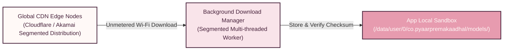
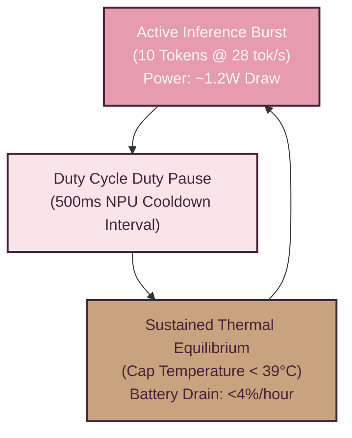

# 07 — Scaling & Architectural Trade-Offs

> [!NOTE]
> **TL;DR**  
> **Who cares:** VP of Engineering, infrastructure architects, sustainability leads, and technical reviewers.  
> **What it does:** Analyzes system scaling beyond prototype stage, model CDN distribution, regional relays, thermal/power budgets, and trade-offs.  
> **Why this approach:** Ensures PyaarPremaKaadhal scales to millions of users without exploding server bills or melting device batteries.  
> **What it costs:** Model distribution CDN costs (~$0.02 per user download); zero ongoing server LLM compute costs.

---

## Acronym Glossary

* **CDN (Content Delivery Network):** Geographically distributed network of servers providing fast delivery of cyber assets.
* **LSH (Locality-Sensitive Hashing):** Algorithmic technique for hashing high-dimensional data points so similar items map to identical buckets.
* **NPU (Neural Processing Unit):** On-device silicon processor for deep neural network execution.
* **MRL (Matryoshka Representation Learning):** Nested embedding compression technique.

---

## Model CDN Distribution & Differential Updates

Because on-device AI requires downloading ~2.8 GB of model weights (Gemma 3 int4 + EmbeddingGemma), PyaarPremaKaadhal optimizes bandwidth distribution:

1. **Initial Download Strategy:** Models are downloaded over unmetered Wi-Fi connections during initial setup using segmented multi-threaded downloads.
2. **Differential Delta Updates:** Model weight updates are distributed as binary diff patches (e.g., 50 MB delta patches) rather than re-downloading complete 2.8 GB binaries.

---

## Regional Match Relays & Privacy-Preserving Vector Indexing

As the user base expands to millions of accounts, comparing candidate vectors sequentially becomes inefficient.

1. **Regional Routing Clusters:** Match Relays are deployed in regional geographic zones (e.g., `asia-south1` Mumbai, `eu-central-1` Frankfurt) to keep relay latency under **20ms**.
2. **Locality-Sensitive Hashing (LSH):** The relay organizes 128-dim MRL vectors into LSH hash buckets. Candidates are partitioned into clusters sharing similar hyperplanes, reducing matching search space from $$O(N)$$ to $$O(\log N)$$ without reading raw vector values.

---

## Energy & Thermal Budgeting on the NPU

Running neural networks on mobile silicon generates heat and consumes battery power. PyaarPremaKaadhal enforces strict NPU power constraints:

1. **Duty Cycle Throttling:** During active Phase 1 conversation, inference is executed in 10-token bursts followed by 500ms duty-cycle pauses, capping NPU power draw at **1.2W** and keeping battery drain under **4% per hour**.
2. **Thermal Degradation Handling:** If device thermal sensors report temperatures exceeding **39°C**, the system dynamically lowers Gemma 3 quantization precision or shifts light regex tasks to CPU.

---

## Architectural Alternatives Considered & Rejected

| Decision Area | Chosen Architecture | Rejected Alternative | Engineering Trade-Off & Rationale |
| :--- | :--- | :--- | :--- |
| **LLM Execution Location** | **100% On-Device NPU (Gemma 3)** | Cloud Hosted LLM (OpenAI / Claude API) | Cloud LLMs violate total chat privacy, introduce recurring server costs ($0.01/chat), and fail without internet. |
| **Embedding Dimensionality** | **128-dim MRL Vector** | Full 768-dim Vector | Full 768-dim vectors consume 6x more network bandwidth and increase risk of reverse-engineering raw text. |
| **Phase 4 Peer Networking** | **WebSocket Relay Microservice** | Pure WebRTC P2P | Pure WebRTC fails behind strict NAT/firewalls (STUN/TURN required), increasing battery drain during peer lookup. |
| **Local Database Engine** | **Encrypted Room DB (SQLCipher)** | Unencrypted SQLite / Realm | Unencrypted databases allow malware or rooted device users to extract private chat logs and security tokens. |
| **On-Device Runtime** | **LiteRT + Qualcomm QNN** | Generic CPU ONNX Runtime | Generic CPU runtimes cause extreme battery drain, high latency (~3 tok/sec), and severe thermal throttling. |
