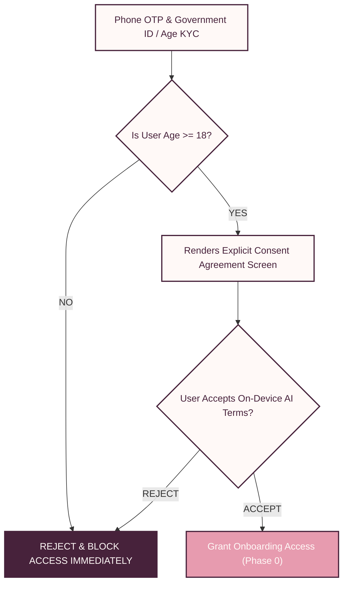
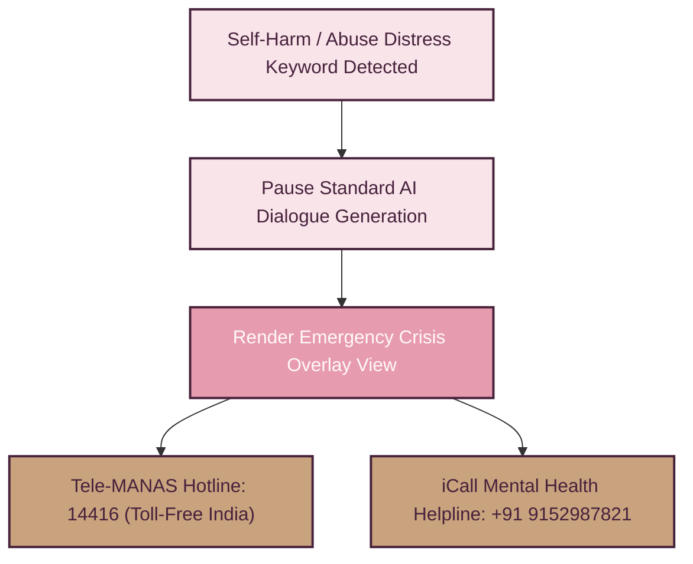

# 08 — Risk, Safety & Ethics Architecture

> [!NOTE]
> **TL;DR**  
> **Who cares:** Ethics boards, legal counsel, compliance officers, and user safety leads.  
> **What it does:** Outlines age-gating, consent mechanics, statutory alignment (DPDP Act India), abuse reporting, and crisis intervention.  
> **Why this approach:** Establishes trust, safety, and legal compliance in an intimate social connection application environment.  
> **What it costs:** Adds mandatory age verification step; 0 risk of central chat database subpoena because chat data remains on-device.

---

## Acronym Glossary

* **DPDP Act (Digital Personal Data Protection Act 2023):** India’s primary statutory data privacy regulation.
* **PII (Personally Identifiable Information):** Data that can identify an individual.
* **OTP (One-Time Password):** Automatically generated numeric or alphanumeric code used for single sign-on authentication.
* **KYC (Know Your Customer):** Identity verification processes required to confirm legal age and identity.

---

## 18+ Age Gating & Consent-First Onboarding

1. **Age Gating:** Users must verify age via phone OTP and third-party identity verification (e.g., DigiLocker / age-gate API). Access is strictly prohibited for users under 18 years of age.
2. **Explicit Granular Consent:** Users must explicitly review and accept plain-language consent agreements before Phase 1 AI dialogue begins, clarifying that on-device Gemma 3 will analyze conversational responses to extract personality vectors.

---

## Alignment with India's DPDP Act 2023

PyaarPremaKaadhal is architected to comply natively with the **Digital Personal Data Protection (DPDP) Act 2023**:

| Statutory Requirement | PyaarPremaKaadhal Technical Implementation |
| :--- | :--- |
| **Data Minimization (Sec. 4)** | Central servers only process 128-dim anonymized MRL vectors. Zero chat logs or raw media are collected centrally. |
| **Purpose Limitation (Sec. 5)** | Vector embeddings are processed strictly for compatibility scoring and automatically purged upon account deletion. |
| **Right to Erasure (Sec. 12)** | Triggering "Delete Profile" instantly purges local Encrypted Room DB, master encryption keys, and cloud relay records. |
| **Local Processing Compliance** | All AI reasoning and text analysis are performed locally on the user's NPU inside Indian territorial jurisdiction. |

---

## Abuse Reporting & Anonymized Audit Trail

During Phase 4 anonymous chat, users are protected against harassment:

1. **Local Instant Block:** Tapping "Block User" instantly severs the WebSocket session and deletes local match records.
2. **Anonymized Report Flagging:** If a user reports severe harassment, an anonymized report flag containing the Match ID and Guardrail Audit Log is submitted to the relay server for administrator review.

---

## Crisis Resource Fallback Integration

If an on-device Gemma 3 dialogue or Phase 4 message contains indicators of self-harm, severe emotional distress, or domestic abuse:

* **Tele-MANAS Hotline (India):** Direct one-tap call button to `14416` (National Tele Mental Health Programme of India).
* **iCall Mental Health Support:** Direct access to `+91 9152987821`.

---

## Honest Scope & Limitations of the Guardrail

> [!WARNING]
> **Safety Boundary Declaration:**  
> The on-device PII Guardrail (Regex + Gemma Prompt Guard + `FLAG_SECURE`) is designed as a **friction and policy enforcement tool** to prevent inadvertent contact sharing and deter bad actors. It does **not** claim to provide an absolute 100% mathematical guarantee against determined human adversarial evasion (such as steganography, complex homoglyph substitution, or offline code words). PyaarPremaKaadhal encourages users to exercise personal caution during the Phase 4 anonymous window.
